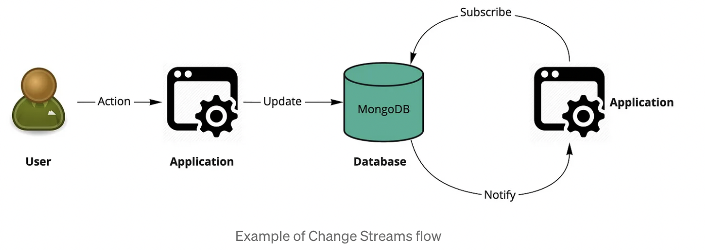

# Change Streams

Start Mongodb with Replication Set (Installed)
    `mongod --dbpath=/Users/2604309/software/localmongodb --replSet "rs"`
    Go to mongo terminal and execute `rs.initiate()`

MongoDB Using docker-compos:
    `sudo docker-compose --env-file .my-env up`
    `sudo docker-compose --env-file .my-env down`

1.  Run [ChangeStreamsApplication](./src/main/java/com/explore/dileepkumar/cdc/ChangeStreamsApplication.java)
2. 

